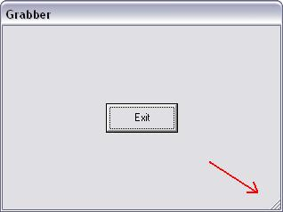



## Sizing Grabber

### Description

Would you believe that the sizing grabber - that is the little triangle in the bottom right hand corner - is in fact disguised a scroll bar? Well, have a look...
 
### More Info
 

             |
---                |---
**Submitted On**   |2005-04-18 02:04:52
**By**             |[ULLI](https://github.com/Planet-Source-Code/PSCIndex/blob/master/ByAuthor/ulli.md)
**Level**          |Intermediate
**User Rating**    |4.9 (54 globes from 11 users)
**Compatibility**  |VB 6\.0
**Category**       |[Windows API Call/ Explanation](https://github.com/Planet-Source-Code/PSCIndex/blob/master/ByCategory/windows-api-call-explanation__1-39.md)
**World**          |[Visual Basic](https://github.com/Planet-Source-Code/PSCIndex/blob/master/ByWorld/visual-basic.md)
**Archive File**   |[Sizing\_Gra1877944172005\.zip](https://github.com/Planet-Source-Code/ulli-sizing-grabber__1-60067/archive/master.zip)

